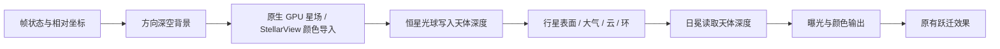

# 太空渲染管线与验证

本文件记录 `refactor/space-render-v2` 新路径的实际实现合同。开发阶段和后续事项见 [技术路线](space-render-roadmap.md)。

## 当前入口与顺序

船舱维度仍在 NeoForge `AFTER_SKY` 渲染，不改变航行状态、宇宙注册表、星图或服务器位置。`SpaceRenderer` 捕获帧状态，去除原版步行晃动，随后执行：



独立目标仅把颜色合成回进入事件时的 framebuffer。Minecraft 方块、实体和玻璃在后续阶段继续使用原有世界深度。事件结束恢复 framebuffer、viewport、深度/混合/裁剪状态、shader、纹理绑定、矩阵排序和雾参数。

## 坐标与深度

- 宇宙坐标保持 sector + double；先相减再旋转，不把巨大绝对坐标上传给 GPU。
- 为复用网格并保持投影精度，行星仍可投到 280 的安全局部距离；这只是几何投影，不再是遮挡距离。
- `DistanceScale` 还原片元观察坐标的真实宇宙尺度。统一深度为 `log2(1 + radialDistance) / 40`，使用独立 `DEPTH_COMPONENT32F` 纹理，1 保留为空背景。
- 行星表面与恒星光球写深度；云、环、大气、日冕读取深度。背景不写深度。环在新路径中使用一个静态完整网格，不再按中心距离手工切两半。
- 有效深度范围约到 `2^40` 个当前宇宙单位。超远距离会饱和；当前候选星系范围远低于它。未来跨星系透镜不能忽略这一限制。
- 行星 LOD 使用外部观察者的准确球体角径 `2 asin(R/d)`。恒星原生路径从已有参考角径推导显示半径，按到恒星自身的距离投影，保留 72 的近景显示上限；它不是新引入的物理恒星数据。

## 颜色与材质

原生路径使用 `RGBA16F` 颜色目标。PNG 漫反射颜色按 sRGB 解码；材质 mask 的 R（光滑/高光权重）、G（自发光）和云 alpha 按线性数据读取。

行星新路径使用随受光角变化的漫反射、GGX 高光和独立自发光。背景辐射、云与恒星能量在合成前保持线性；最终按固定曝光和白点曲线转换到显示颜色。曝光只影响太空背景，不影响方块、实体或 GUI。

StellarView 继续负责可选背景星场。其显示颜色先绘入独立 LDR 目标，再解码并加到线性空间；不要求该模组理解新材质或修改其 API。其内部已截断的亮度无法由本项目恢复。

若旧背景或颜色适配 shader 不可用，保留显示颜色兼容模式；独立天体深度仍可工作。资源失败导致核心 shader 缺失时切到 `DIRECT` 路径，资源重载后重新尝试。

当前大气仍是经过深度适配的旧光晕模型；还没有透射/完整单次散射。云和环之间的透明合成，以及日冕与透明环之间的能量衰减仍需专项改进。不要把此阶段当作最终体积管线。

## 配置与回退

编辑客户端 `starboundmc-client.toml`：

| 配置 | 默认 / 用途 |
| --- | --- |
| `spacePipelineMode` | `ISOLATED`；`DIRECT` 返回原有天体绘制路径 |
| `spaceBackgroundMode` | `PROCEDURAL`；`LEGACY` 返回旧天空与 CPU 原生星点 |
| `spaceExposure` | `1.0`；原生线性颜色模式范围 0.25–4 |
| `spaceVisualQuality` | `BALANCED`；保留现有云、云影、大气、可选星场组合 |

原生背景星预算分别为 2,000 / 6,000 / 10,000 / 16,000；Custom 为 10,000。目录使用固定种子且低档是高档的稳定前缀，切画质时已有星点保持位置。目录只在资源重载或首次使用对应预算时上传。

完整视觉回退组合为 `spacePipelineMode = "DIRECT"` 和 `spaceBackgroundMode = "LEGACY"`。本地提交 `eae609c` 是独立深度迁移前的检查点。各阶段只修改本工作树，无远程推送或玩法数据迁移。

## 运行验证

要求 Java 21；本机安装路径 `E:/Develop/Program Files/Android Studio/jbr`。共享 Gradle 缓存含当前 NeoForge 和可选依赖，示例为 PowerShell：

```powershell
.\gradlew.bat --gradle-user-home ../.gradle-home --offline '-Dorg.gradle.java.installations.paths=E:/Develop/Program Files/Android Studio/jbr' test build
.\gradlew.bat --gradle-user-home ../.gradle-home --offline '-Dorg.gradle.java.installations.paths=E:/Develop/Program Files/Android Studio/jbr' -PspaceSmoke -PspaceSmokeLabel=isolated runClient
.\gradlew.bat --gradle-user-home ../.gradle-home --offline '-Dorg.gradle.java.installations.paths=E:/Develop/Program Files/Android Studio/jbr' -PspaceSmoke -PspaceSmokeLabel=stellarview -PspaceSmokeStellarView=true runClient
.\gradlew.bat --gradle-user-home ../.gradle-home --offline '-Dorg.gradle.java.installations.paths=E:/Develop/Program Files/Android Studio/jbr' -PspaceSmoke -PspaceSmokeLabel=direct -PspaceSmokePipeline=direct -PspaceSmokeBackground=legacy runClient
```

`spaceSmoke` 显式加入 `src/renderTest/java`，普通生产构建不包含夹具。夹具创建新测试世界，运行在 `run-space-smoke`，不打开用户存档。隐藏窗口但保持渲染。

12 个视点覆盖六种行星/卫星、深空、恒星近景、银河方向、玻璃舷窗、960×540 缩放及资源重载。结果写入 `run-space-smoke/screenshots/<label>`：

- PNG 为实际客户端图像；TXT 包含分辨率、GPU/驱动、样本数、CPU/GPU P50/P95 和资源计数。
- `depth-checks.txt` 使用实际 GPU shader 验证恒星在前/行星在前，分别交换绘制顺序，并检查世界深度哨兵和事件状态恢复。
- `complete.txt` 只在本轮所有捕获和深度检查成功后写入。
- GPU 时间用异步 timestamp 成对查询，只读取已完成结果，不使用 `glFinish`。`TOTAL` 包含事件入口状态保存和最终颜色合成；单个 pass 计时不能相加替代它。
- 生产测量可使用 JVM 参数 `-Dstarboundmc.debug.spaceProfile=true`，每 10 秒把统计写入客户端日志；默认不建立计时 query。

捕获固定原生动画时间。全客户端帧时间包含限帧、世界加载和后台调度；短测试的 GPU P95 会受功耗/调度影响，不可用作跨硬件性能结论。

## 已知验证边界与下一步

已执行矩阵是 Minecraft 1.21.1、NeoForge 21.1.248、Windows、NVIDIA RTX 3060 Laptop 和当前工作树的 StellarView 构建。尚未覆盖 AMD、Intel、macOS、Iris/Oculus shaderpack、复杂多人航行与多个透明天体交叠。`DIRECT` 是明确可用的兼容回退。

新背景闪烁按长 tick 取模后生成相位。旧行星自转和 LOD 仍共享 float 动画 tick；长存档精度与屏幕亚像素星点稳定性将在时间/像素预算迁移时继续处理。

接下来先拆分不透明天体与透明体积的提交，替换亮边大气为透射/散射，并加入低分辨率 Bloom、行星与环的食影。随后进行像素 LOD、网格/采样预算与跨硬件测量。黑洞使用方向背景、统一天体距离和线性颜色作为基础，曲线光线采样、背景星环境贴图及自旋解算仍是后续专项。
